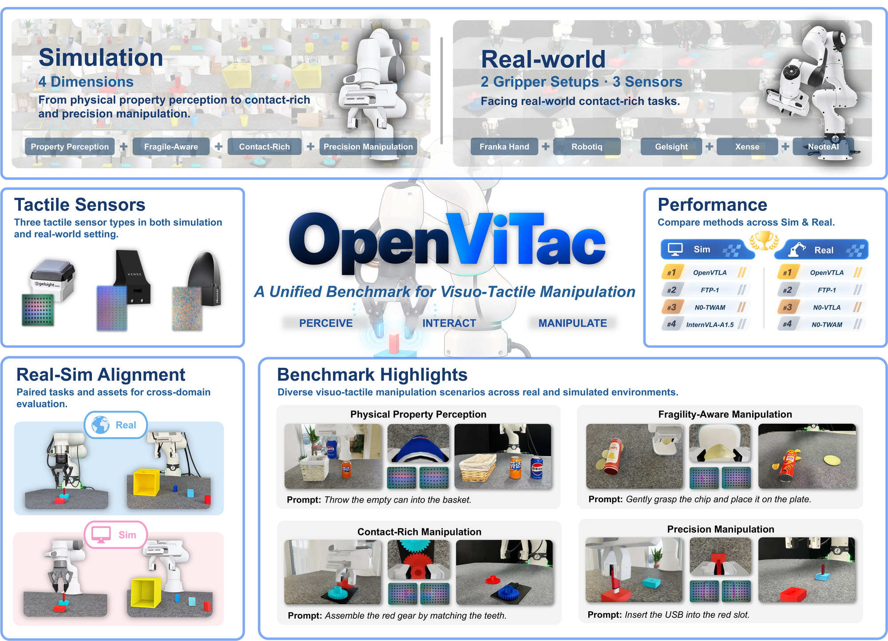
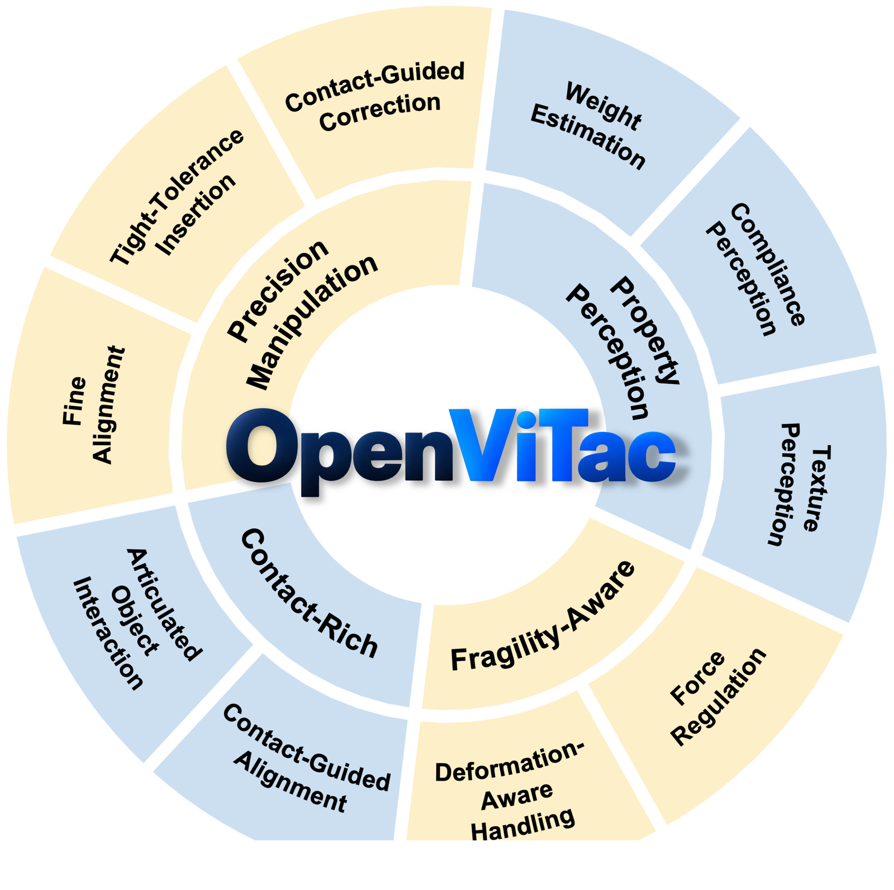
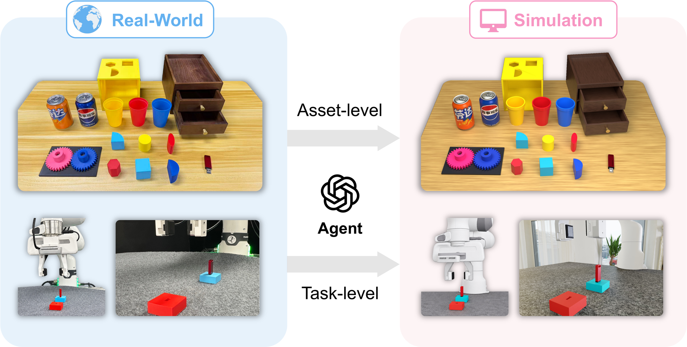
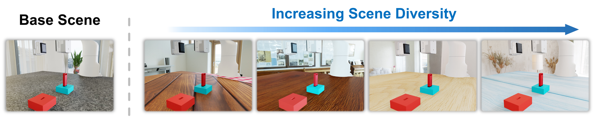
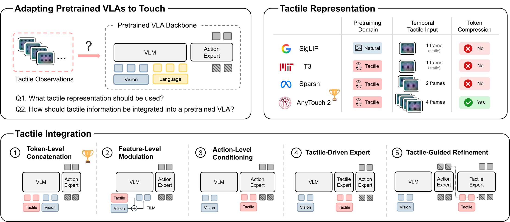

<h1 align="center">OpenViTac</h1>
<h3 align="center">Learning and Benchmarking Visuo-Tactile Policies<br>in a Unified Sim-and-Real Framework</h3>

<p align="center">
  <strong>A unified benchmark for robots that see and feel.</strong>
</p>

<p align="center">
  <a href="https://fvl-repo.github.io/OpenViTac/"></a>
  <a href="https://github.com/FVL-Repo/OpenViTac"></a>
  <a href="#quick-start"></a>
</p>
<p align="center">
  
  
  
</p>

<p align="center">
  <a href="#highlights">Highlights</a> &nbsp;|&nbsp;
  <a href="#benchmark">Benchmark</a> &nbsp;|&nbsp;
  <a href="#openvtla">OpenVTLA</a> &nbsp;|&nbsp;
  <a href="#results">Results</a> &nbsp;|&nbsp;
  <a href="#quick-start">Quick start</a> &nbsp;|&nbsp;
  <a href="#documentation">Documentation</a> &nbsp;|&nbsp;
  <a href="#citation">Citation</a>
</p>

<p align="center">
  <a href="docs/media/teaser.png"></a>
  <br>
  <sub>One benchmark. Paired simulation and reality. Four dimensions of touch.</sub>
</p>

**OpenViTac** is a visuo-tactile manipulation benchmark for evaluating robot policies across simulation and the real world. It brings physical properties, fragile objects, sustained contact, and precise insertion into a shared evaluation framework for **VLA**, **WAM**, and **VTLA** policies.

Building on the benchmark, **OpenVTLA** adapts a pretrained vision-language-action model to touch through a temporally aware tactile encoder and token-level integration. Paired simulation and real-world settings also enable the study of sim-real co-training.

<details>
<summary><strong>Authors and affiliations</strong></summary>

Yifan Wu<sup>1,*</sup>, Qin Li<sup>3,*</sup>, Nan Min<sup>1,*</sup>, Guojin Zhong<sup>1,†</sup>, Haoyu Zhao<sup>1,†</sup>, Zhiyuan Li<sup>1</sup>, Houze Xu<sup>1</sup>, Shengqi Xu<sup>1</sup>, Xingyao Lin<sup>1</sup>, Zijie Diao<sup>1,2</sup>, Zhaoxiang Liu<sup>6</sup>, Shiguo Lian<sup>6</sup>, Shunlin Lu<sup>5</sup>, Shihao Zhao<sup>5</sup>, Ziyi Ye<sup>1,‡</sup>, Zuxuan Wu<sup>1,2,5,‡</sup>, Yu-Gang Jiang<sup>1</sup>

<sup>1</sup> Fudan University · <sup>2</sup> Shanghai Innovation Institute · <sup>3</sup> Hefei University of Technology · <sup>5</sup> Neote AI · <sup>6</sup> China Unicom

<sup>*</sup> Equal contribution. <sup>†</sup> Project leaders. <sup>‡</sup> Corresponding authors.

</details>

## Highlights

| Simulation tasks | Paired real-world tasks | Tactile capabilities | Tactile sensor types |
| :---: | :---: | :---: | :---: |
| **11** | **8** | **4** | **3** |

- **Evaluate what vision misses.** Test physical-property perception, fragility-aware interaction, contact-rich manipulation, and precision manipulation under task-specific success criteria.
- **Connect simulation with reality.** Corresponding assets and task configurations support comparative evaluation across domains, with two gripper setups and three tactile sensor types.
- **Study how touch enters a policy.** Compare four tactile representations and five integration strategies for adapting pretrained VLAs.
- **Collect, learn, and evaluate.** Scripted experts, multimodal HDF5 trajectories, local learning workflows, and remote policy adapters share task and observation interfaces.

## Benchmark

The paper's task suite spans four complementary capabilities. **All 11 tasks are evaluated in simulation; eight have paired real-world evaluations.**

| Capability | What it tests | Simulation tasks | Paired real-world tasks |
| :--- | :--- | :--- | :--- |
| **Property perception** | Infer physical properties that are visually ambiguous | Weight classification, hardness classification, roughness classification, roughness-guided regrasp, empty-can selection | Roughness classification, empty-can selection |
| **Fragility-aware** | Regulate contact without damaging delicate objects | Grasp chip | Grasp chip |
| **Contact-rich** | Maintain effective contact during manipulation | Gear assembly, pull drawer | Gear assembly, pull drawer |
| **Precision** | Align and insert under tight geometric tolerances | Insert USB, insert block v1, insert block v2 | Insert USB, insert block v1, insert block v2 |

<details>
<summary><strong>View the capability taxonomy</strong></summary>

<p align="center">
  
</p>

</details>

Task implementations live in [`envs/`](envs/); sensor configurations live in [`task_config/`](task_config/). The repository also includes additional manipulation scenarios beyond the paper suite. The default batch collection list is an eight-task development suite; select tasks explicitly for benchmark experiments and use the intended task conditions.

### From real-world references to simulation

An agent-assisted pipeline reconstructs task-relevant assets and builds corresponding simulation tasks. Scene diversification varies backgrounds, workspace appearance, and surrounding context while preserving the task configuration.

<p align="center">
  <a href="docs/media/real_sim_alignment.png"></a>
</p>

<details>
<summary><strong>Explore scene diversity</strong></summary>

<p align="center">
  
</p>

</details>

### Three sensors, a common workflow

| Sensor | Configuration | Tactile observations |
| :--- | :--- | :--- |
| **GelSight** | [`gelsight.yml`](task_config/gelsight.yml) | RGB, marker RGB, marker motion, depth, pose |
| **Xense** | [`xense.yml`](task_config/xense.yml) | RGB, marker RGB, marker motion, depth, pose |
| **Neote** | [`neote.yml`](task_config/neote.yml) / [`neote_force_field.yml`](task_config/neote_force_field.yml) | Gel-particle or dense force-field exports |

The two Neote configurations select different representations from the same sensor. See the [configuration guide](docs/Usage.md#task-config-hyperparameters) for export settings and policy input requirements.

## OpenVTLA

**Temporal touch, integrated early.** OpenVTLA uses **AnyTouch2** to encode tactile history into compact tokens, projects them to the VLM hidden dimension, and prepends them to the visual token sequence of **π₀.₅**. It preserves the original vision-language and action-generation pathway without an additional fusion module or tactile-specific expert.

<p align="center">
  <a href="docs/media/tactile_design.png"></a>
  <br>
  <sub>What should touch represent, and where should it enter the policy?</sub>
</p>

The repository includes an [OpenPI vision/tactile client](policy/openpi/README.md) and [deployment configurations](policy/openpi/abs_joint/). Remote-policy evaluation requires a separately configured model server and checkpoints. Model and dataset release links will be added when available.

## Results

**OpenVTLA achieves the highest reported average success rate among the evaluated policies in both domains.** The table below highlights tactile-enabled policies and the π₀.₅ backbone.

| Policy | Family | Simulation success (%) | Real-world success (%) |
| :--- | :---: | ---: | ---: |
| **OpenVTLA (ours)** | VTLA | **68.7** | **54.6** |
| FTP-1 | VTLA | 61.2 | 51.9 |
| N0-VTLA | VTLA | 51.1 | 49.6 |
| N0-TWAM | WAM | 53.3 | 48.5 |
| π₀.₅ | VLA | 48.6 | 41.0 |

*Reported manuscript results. Each policy is trained per task; averages are unweighted means across 11 simulation tasks or 8 real-world tasks. The two domain averages cover different task sets.*

- **Sim-real consistency:** Pearson **r = 0.913** across nine policies with complete results on the eight shared tasks. OpenVTLA and FTP-1 rank first and second in both domains.
- **Simulation supports real-world learning:** with **100 real demonstrations per task**, adding **500 simulated demonstrations** improves OpenVTLA from **20% to 40%** on USB insertion and **50% to 60%** on gear assembly.

See the [project website](https://fvl-repo.github.io/OpenViTac/) for per-task comparisons and the complete evaluated policy set.

## Quick start

### Install

**Environment:** Ubuntu Linux, an NVIDIA GPU, Python 3.10, CUDA 12.4-compatible PyTorch, Isaac Sim 4.5.0, and Isaac Lab 2.1.1. The installer sets up cuRobo and the bundled modified TacEx/UIPC packages.

```bash
git clone https://github.com/FVL-Repo/OpenViTac.git
cd OpenViTac

# Initialize Conda in your shell before running the installer.
conda activate base
bash scripts/install.sh
conda activate OpenViTac
```

Use the bundled `third_party/TacEx` source: OpenViTac depends on project-specific sensor and simulation changes. Building libuipc can take substantial time. See the [installation guide](docs/Installation.md) for the component-by-component setup.

### Collect a first demonstration

From the repository root, try one successful USB-insertion episode with GelSight observations over seeds 0 through 4:

```bash
python scripts/collect_data.py insert_USB task_config/gelsight.yml \
  --gpu 0 \
  --start_seed 0 \
  --max_seed 4 \
  --episode_num 1
```

The supplied GelSight configuration writes to `data_gelsight/insert_USB/gelsight/`. Successful episodes include HDF5 trajectories and preview videos; failed attempts are recorded for resumable collection. If no attempt succeeds within the seed range, increase `--max_seed`.

For larger runs and policy learning, continue with:

- [Serial, balanced, and parallel data collection](docs/Usage.md#data-collection)
- [HDF5 observation schema](docs/Collection.md)
- [ACT preprocessing and training](docs/Usage.md#training)
- [Policy rollout and evaluation](docs/Usage.md#inference--rollout)

> **Data paths:** ACT preprocessing expects `data/<task>/<config>`. When preparing ACT datasets, set `save_dir: ./data` in the collection configuration or provide a link to your collected dataset, as described in the workflow guide.

## Documentation

| I want to… | Start here |
| :--- | :--- |
| Set up the simulator and dependencies | [Installation](docs/Installation.md) |
| Collect data, configure sensors, and train ACT | [Workflow guide](docs/Usage.md) |
| Understand observations and saved trajectories | [Data collection and schema](docs/Collection.md) |
| Add a task | [Task creation](docs/TaskCreation.md) |
| Connect a new policy | [Policy deployment](docs/Deploy.md) |
| Generate diverse trajectories with RFCL | [RL-based data collection](docs/RLDataCollection.md) |
| Use an existing policy adapter | [OpenPI](policy/openpi/README.md), [FTP-1](policy/ftp-1/README.md), [N0-VTLA](policy/n0-vtla/README_commands.md), [InternVLA-A1.5](policy/internvla_a1_5/README_commands.md) |

<details>
<summary><strong>Repository map</strong></summary>

```text
OpenViTac/
├── envs/              # Tasks, robots, cameras, and tactile sensors
├── task_config/       # Sensor observations and task settings
├── assets/            # Robot, object, and scene assets
├── asset_tools/       # Asset-processing utilities
├── scripts/           # Collection, evaluation, installation, and RFCL
├── bash_scripts/      # Batch workflows and task-specific conditions
├── policy/            # Local learning baselines and remote policy clients
├── encoder/           # Tactile representation learning
├── docs/              # Guides and project figures
├── tests/             # Task and learning workflow tests
└── third_party/       # Bundled simulation dependencies
```

</details>

## Citation

If OpenViTac is useful for your research, please consider citing our work. This is a preliminary citation; publication details will be added with the paper release.

```bibtex
@misc{wu2026openvitac,
  title={OpenViTac: Learning and Benchmarking Visuo-Tactile
         Policies in a Unified Sim-and-Real Framework},
  author={Wu, Yifan and Li, Qin and Min, Nan and Zhong, Guojin
          and Zhao, Haoyu and Li, Zhiyuan and Xu, Houze
          and Xu, Shengqi and Lin, Xingyao and Diao, Zijie
          and Liu, Zhaoxiang and Lian, Shiguo and Lu, Shunlin
          and Zhao, Shihao and Ye, Ziyi and Wu, Zuxuan
          and Jiang, Yu-Gang},
  year={2026}
}
```

---

Questions, reproducibility issues, or new task ideas? [Open an issue](https://github.com/FVL-Repo/OpenViTac/issues).
